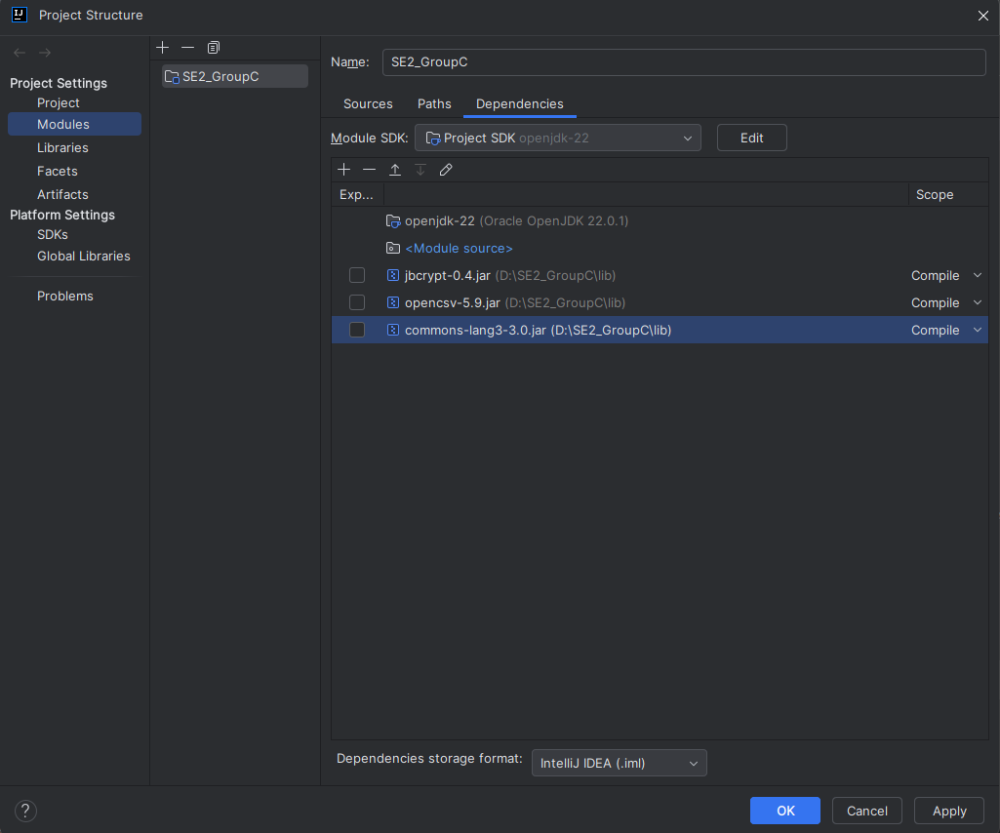

# SE2_GroupC
SE2 NewBank Group Project Group C

## Introduction
NewBank is a banking application that allows customers to interact with their accounts via a simple command-line client.

## Protocol
The client and server communicate via a simple protocol. Please refer to the Protocol document for details of the application protocols between the client and the server.

## Getting Started

### Prerequisites
- An IDE of your choice to debug and run the code.
- An SSH key set up against your account to be able to clone the repository and pull/push changes to it.

### Building and Running  

#### Step 1: Clone the repository
From a command prompt, run:

```sh
git clone git@github.bath.ac.uk:mtk51/SE2_GroupC.git
```

#### Step 2: Compile the application (from an IDE)
Use the Import facility of your IDE to import an existing project.
Right-click on the project and select "Mark Directory as" to mark the "src" directory as Sources Root directory.

### Adding a Dependency Manually

If your project is not using a build tool like Maven or Gradle, you can manually add dependencies by following these steps:

1. **Download the JAR file** for the dependency you need.
2. **Place the JAR file** in your project's `libs` directory (you may need to create this directory).
3. **Add the JAR file to your project dependencies**:
   - Right-click on the project in the Project tool window.
   - Select `Open Module Settings` (or press `F4`).
   - Select `Modules` in the left-hand pane.
   - Click on the `Dependencies` tab.
   - Click the `+` button, select `JARs or directories`, and navigate to the JAR file you added to the `libs` directory.
   - Click `OK` and `Apply`.



#### Step 3: Run the application
Run the server (from one terminal)
Run the client (from another terminal)

#### Customers "Database"
This project uses a CSV file as a means to simulate having a database to load customers from/ write customers to.
The csv file must not be modified manually, the application takes care of doing the needed modifications.
